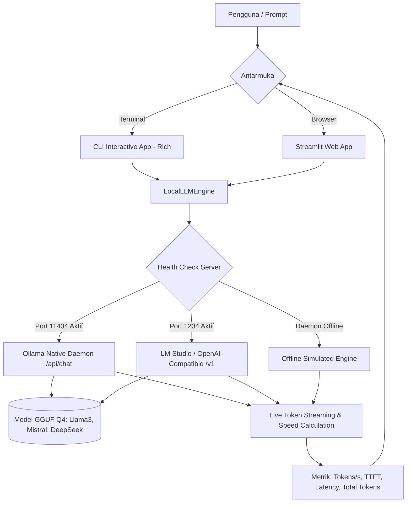

# Day 13: Local LLM Offline Runner 🤖

Aplikasi inferensi **AI Lokal (On-Device Inference)** yang berjalan 100% di komputer lokal tanpa ketergantungan pada Cloud API pihak ketiga. Menjamin kerahasiaan data tingkat tinggi (**Zero Data Leakage & GDPR/HIPAA Compliant**), bebas biaya token langganan, dan dapat beroperasi penuh secara offline.

Dilengkapi dengan streaming teks secara langsung (*token-by-token*) serta pengukuran performa inferensi real-time (**Tokens Per Second / TPS**, **Time to First Token / TTFT**, dan latensi).

---

## 🌟 Fitur Utama

1. **Dual-Mode Local Engine**:
   - **Mode Fisik (Live Daemon)**: Terhubung otomatis ke [Ollama](https://ollama.com) (`http://localhost:11434`) atau server lokal berstandar OpenAI seperti **LM Studio** / **llama.cpp** (`http://localhost:1234/v1`).
   - **Mode Simulasi Cerdas (Fallback)**: Jika daemon belum dinyalakan, aplikasi secara cerdas beralih ke engine simulasi berkecepatan ~40 t/s tanpa error atau crash, lengkap dengan panduan aktivasi.
2. **Real-Time Token Streaming**:
   - Menghasilkan respons kata demi kata dengan efek visual typewriter baik di Terminal maupun di Web UI.
3. **Hardware Speed & Latency Benchmark**:
   - Mengukur **Throughput Kecepatan (Tokens/s)**, **Time to First Token (TTFT)**, dan **Total Wall Duration** untuk menguji kapabilitas CPU/GPU Anda.
4. **Model Metadata Explorer**:
   - Menampilkan arsitektur model, parameter count (1.3B, 1.5B, 7B, 8B), keluarga model (*Llama, Mistral, DeepSeek*), dan format kuantisasi (*Q4_K_M, Q4_0*).
5. **Dua Antarmuka Lengkap**:
   - **Terminal CLI** berbasis library `rich` dengan tabel metrik interaktif.
   - **Web UI** modern berbasis `streamlit` dengan badge status server, parameter tuning (temperature & system prompt), dan panduan privasi komprehensif.

---

## 🏗️ Diagram Arsitektur



---

## 📊 Metrik Inferensi yang Diukur

| Metrik | Deskripsi | Standar Performa Ideal |
|---|---|---|
| **Tokens / Sec (t/s)** | Kecepatan model menghasilkan kata per detik. | **> 25 t/s** (Sangat nyaman dibaca) |
| **TTFT (Time To First Token)** | Waktu tunggu dari pengiriman prompt hingga karakter pertama muncul. | **< 300 ms** (Responsif instan) |
| **Eval Tokens** | Jumlah total token keluaran yang diproduksi oleh model. | Tergantung panjang respons |
| **Kuantisasi GGUF** | Kompresi bobot model (misal FP16 menjadi 4-bit Q4_K_M). | Menghemat hingga **70% VRAM/RAM** |

---

## 🚀 Cara Menjalankan

### 1. Terminal Interactive CLI
Jalankan perintah berikut di direktori proyek:
```bash
python cli.py
```
**Menu yang tersedia:**
* `[1]` Chat Interaktif (Streaming langsung di terminal)
* `[2]` Uji Benchmark Kecepatan (Tokens/s & TTFT)
* `[3]` Ubah Server URL
* `[4]` Panduan Setup Ollama
* `[5]` Keluar

### 2. Streamlit Web UI
Jalankan server web Streamlit:
```bash
streamlit run app.py
```
Buka browser di `http://localhost:8501`.

---

## 💻 Panduan Menjalankan Model Fisik dengan Ollama

Jika Anda ingin menjalankan model secara fisik di CPU/GPU komputer:

1. **Download & Pasang Ollama**: Kunjungi [ollama.com](https://ollama.com).
2. **Jalankan Service**:
   ```bash
   ollama serve
   ```
3. **Unduh Model yang Direkomendasikan**:
   * **Laptop Standar (4GB - 8GB RAM)**:
     ```bash
     ollama pull llama3.2:1b
     ollama pull deepseek-r1:1.5b
     ```
   * **PC dengan Dedicated GPU (RTX 3060+ / 8GB+ VRAM)**:
     ```bash
     ollama pull mistral:7b
     ollama pull llama3.1:8b
     ```
4. Buka kembali aplikasi ini, dan model yang Anda unduh akan otomatis terdeteksi!

---

## 🛡️ Aturan Keamanan & Privasi
* **Zero Telemetry**: Kode program tidak menyimpan atau mengirimkan percakapan ke server eksternal mana pun.
* **Network Isolation**: Aplikasi dapat dijalankan dalam mode *Airplane Mode* / tanpa koneksi internet.
* **No Hardcoded Credentials**: Seluruh konfigurasi menggunakan parameter dinamis.
